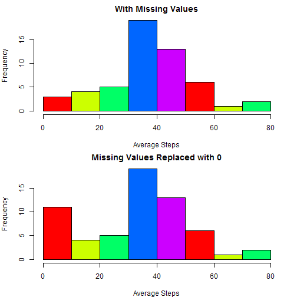

Reproducible Research Course Project 1
==========================


Load the activity.csv file

```r
library(dplyr)
library(knitr)
data = read.csv("activity.csv")
```

1) What is mean total number of steps taken per day?
Histogram of the total number of steps taken each day:

```r
op = par(mfrow=c(1,1), mar=c(4,4,2,2))
with(data, hist(steps, main="Total Steps per Day",col= rainbow(5))); op
```

 

```
## $mfrow
## [1] 1 1
## 
## $mar
## [1] 5.1 4.1 4.1 2.1
```

Calculate and report the mean and median total number of steps taken per day

```r
summarise(data, mean = mean(steps, na.rm = TRUE))
```

```
##    mean
## 1 37.38
```

```r
summarise(data, median = median(steps, na.rm = TRUE))
```

```
##   median
## 1      0
```

2) What is the average daily activity pattern?
Make a time series plot (i.e. type = "l") of the 5-minute interval (x-axis) and the average number of steps taken, averaged across all days (y-axis)


```r
groupby <- group_by(data, date)
summarise(groupby, mean = mean(steps))
```

```
## Source: local data frame [61 x 2]
## 
##          date    mean
## 1  2012-10-01      NA
## 2  2012-10-02  0.4375
## 3  2012-10-03 39.4167
## 4  2012-10-04 42.0694
## 5  2012-10-05 46.1597
## 6  2012-10-06 53.5417
## 7  2012-10-07 38.2465
## 8  2012-10-08      NA
## 9  2012-10-09 44.4826
## 10 2012-10-10 34.3750
## 11 2012-10-11 35.7778
## 12 2012-10-12 60.3542
## 13 2012-10-13 43.1458
## 14 2012-10-14 52.4236
## 15 2012-10-15 35.2049
## 16 2012-10-16 52.3750
## 17 2012-10-17 46.7083
## 18 2012-10-18 34.9167
## 19 2012-10-19 41.0729
## 20 2012-10-20 36.0938
## 21 2012-10-21 30.6285
## 22 2012-10-22 46.7361
## 23 2012-10-23 30.9653
## 24 2012-10-24 29.0104
## 25 2012-10-25  8.6528
## 26 2012-10-26 23.5347
## 27 2012-10-27 35.1354
## 28 2012-10-28 39.7847
## 29 2012-10-29 17.4236
## 30 2012-10-30 34.0938
## 31 2012-10-31 53.5208
## 32 2012-11-01      NA
## 33 2012-11-02 36.8056
## 34 2012-11-03 36.7049
## 35 2012-11-04      NA
## 36 2012-11-05 36.2465
## 37 2012-11-06 28.9375
## 38 2012-11-07 44.7326
## 39 2012-11-08 11.1771
## 40 2012-11-09      NA
## 41 2012-11-10      NA
## 42 2012-11-11 43.7778
## 43 2012-11-12 37.3785
## 44 2012-11-13 25.4722
## 45 2012-11-14      NA
## 46 2012-11-15  0.1424
## 47 2012-11-16 18.8924
## 48 2012-11-17 49.7882
## 49 2012-11-18 52.4653
## 50 2012-11-19 30.6979
## 51 2012-11-20 15.5278
## 52 2012-11-21 44.3993
## 53 2012-11-22 70.9271
## 54 2012-11-23 73.5903
## 55 2012-11-24 50.2708
## 56 2012-11-25 41.0903
## 57 2012-11-26 38.7569
## 58 2012-11-27 47.3819
## 59 2012-11-28 35.3576
## 60 2012-11-29 24.4688
## 61 2012-11-30      NA
```


```r
op = par(mfrow=c(1,1), mar=c(4,4,2,2))
with(avgAll,{
        plot(date, mean, type="n", main="Average Steps", xlab="Day of the Week", ylab="Mean")
        lines(date,mean)
})
```

 

```r
op
```

```
## $mfrow
## [1] 1 1
## 
## $mar
## [1] 5.1 4.1 4.1 2.1
```

Which 5-minute interval, on average across all the days in the dataset, contains the maximum number of steps?

```r
groupBy3 <- group_by(data, date)
avgAll2 = summarise(groupBy3, mean = mean(steps))
max = max(avgAll2$mean, na.rm = TRUE); max
```

```
## [1] 73.59
```

3) Imputing missing values

Devise a strategy for filling in all of the missing values in the dataset. 

```r
avgAll3[is.na(avgAll3)] = 0
```


Make a histogram of the total number of steps taken each day  


```r
op = par(mfrow=c(2,1), mar=c(4,4,2,2))
hist(avgAll2$mean,
     main="With Missing Values",
     xlab = "Average Steps",
     col= rainbow(5))
hist(avgAll3$mean,
     main="Missing Values Replaced with 0",
     xlab = "Average Steps",
     col= rainbow(5))      
```

 

```r
op
```

```
## $mfrow
## [1] 1 1
## 
## $mar
## [1] 5.1 4.1 4.1 2.1
```


4) Are there differences in activity patterns between weekdays and weekends?

Create a new factor variable in the dataset with two levels - "weekday" and "weekend" indicating whether a given date is a weekday or weekend day.


```r
addWeekdays =
mutate(avgAll3,
      weekdays = ifelse(!weekdays(as.Date(avgAll3$date)) %in% c("Saturday", "Sunday"),"weekday","weekend"))

filterWeekdays = filter(addWeekdays, weekdays == 'weekday')       
filterWeekends = filter(addWeekdays, weekdays == 'weekend')

weekdayDate = filterWeekdays$date
weekendDate = filterWeekends$date

weekdayMean = filterWeekdays$mean
weekendMean = filterWeekends$mean
```

Make a panel plot containing a time series plot


```r
op = par(mfrow=c(2,1), mar=c(4,4,2,2))
with(filterWeekdays, {        
        plot(weekdayDate, weekdayMean, type="n", main="Weekdays", ylab="Mean", xlab="Day of the Week") 
        lines(weekdayDate, weekdayMean)
})
with(filterWeekends, {        
        plot(weekendDate, weekendMean, type="n", main="Weekends", ylab="Mean", xlab="Day of the Week") 
        lines(weekendDate, weekendMean)
}) 
```

 

```r
op
```

```
## $mfrow
## [1] 1 1
## 
## $mar
## [1] 5.1 4.1 4.1 2.1
```


